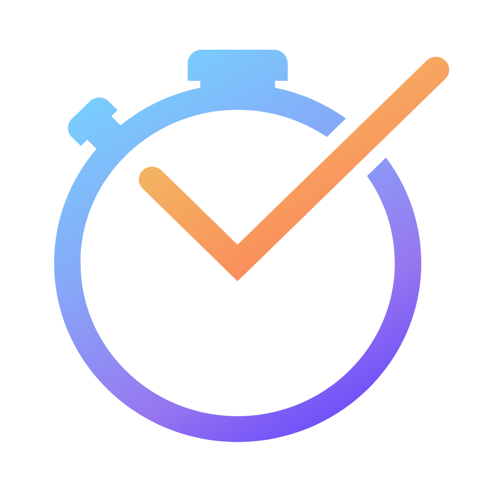

<p align="center"></p>

 
# <p align="center"> Time Planner  </p>
 <b>Time Planner - You can now use your time efficiently with quick time management and planning with Time Planner. With Firebase DB, you can check the work you have completed, and with the change of theme, you can work in an interface according to your taste.</b>
 

 
## Making
- Ease of Use.
- Flutter
- Firebase DB, Auth
Certainly! Here is an example README file template for a Flutter application:

```markdown
# Your App Name

Brief description of your app.

## Table of Contents

- [Introduction](#introduction)
- [Features](#features)
- [Getting Started](#getting-started)
  - [Prerequisites](#prerequisites)
  - [Installation](#installation)
- [Usage](#usage)
- [Screenshots](#screenshots)
- [Contributing](#contributing)
- [License](#license)

## Introduction

Provide a short introduction to your app. What is it about? What problems does it solve?

## Features

List the key features of your app.

- Feature 1
- Feature 2
- ...

## Getting Started

### Prerequisites

Specify any prerequisites or system requirements to run your app.

### Installation

Provide step-by-step instructions on how to install and run your app.

```bash
# Clone the repository
git clone https://github.com/your-username/your-app.git

# Change directory
cd your-app

# Install dependencies
flutter pub get

# Run the app
flutter run
```

## Usage

Explain how to use your app. Provide code snippets or examples if necessary.

## Screenshots

Include screenshots or GIFs showcasing your app.

## Contributing

Provide guidelines for contributing to your project. Include information on how to submit issues or pull requests.

## License

This project is licensed under the [MIT License](LICENSE).
```

Feel free to customize this template based on your app's specific details and structure.
  

https://github.com/DevarshDhmeilya/Time-Planner/assets/114206661/c7aa6584-f6d7-47bb-9719-de8571e72310


